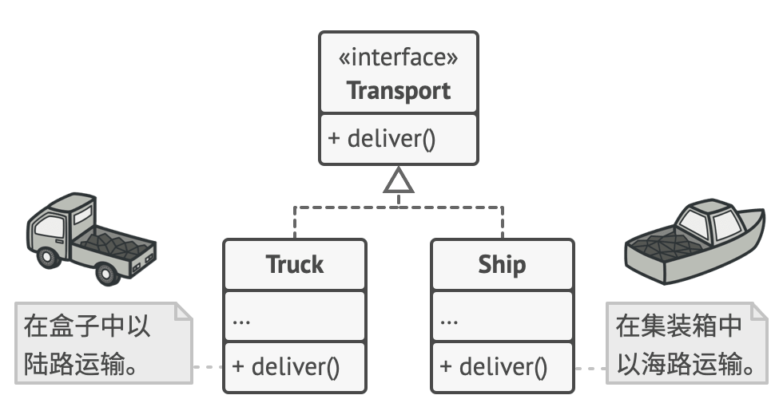
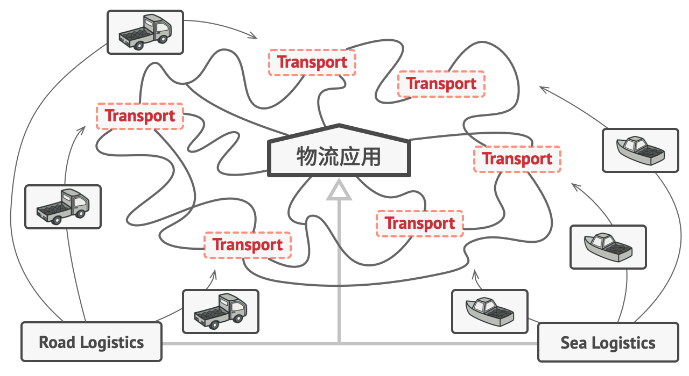
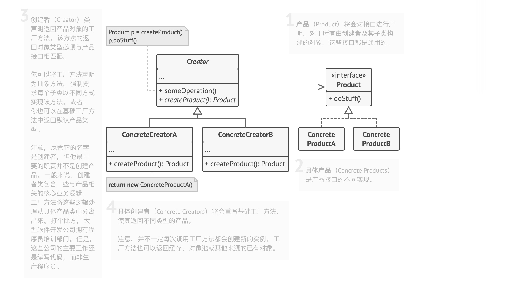
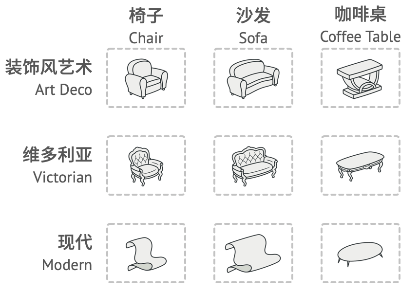
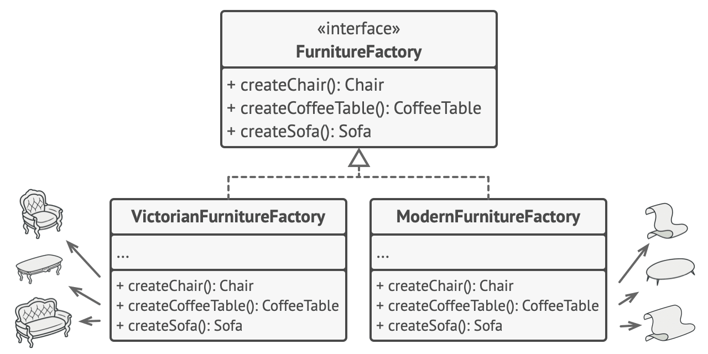
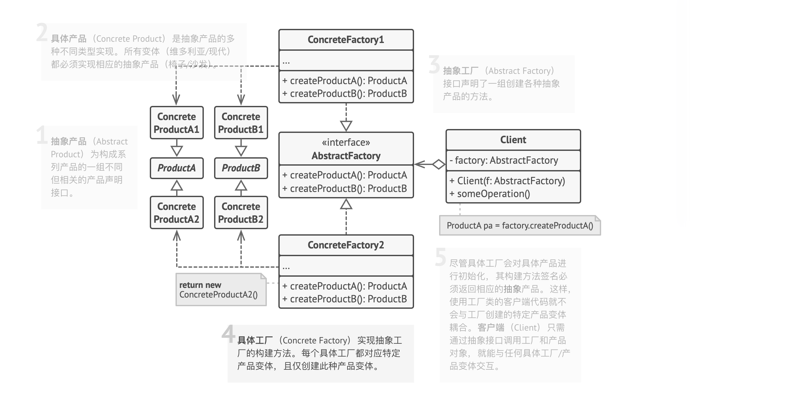
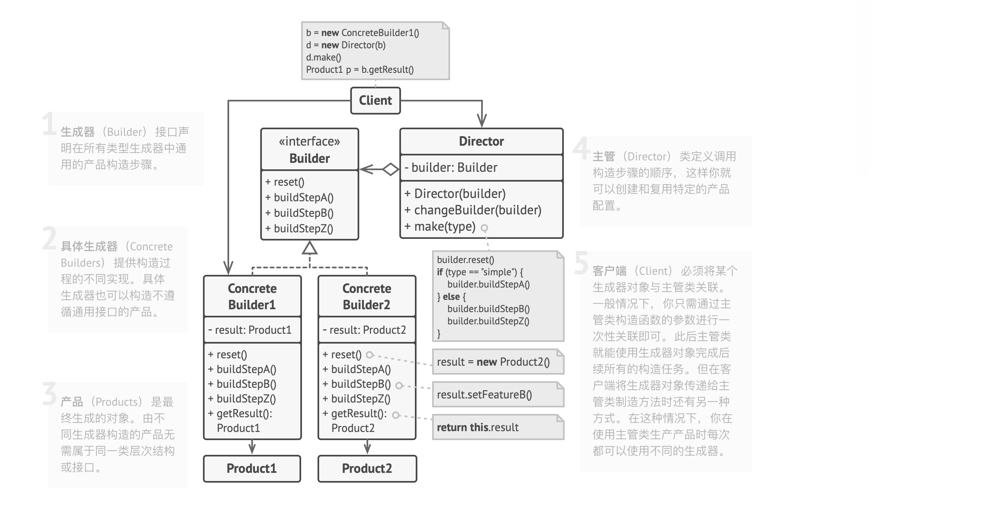

# Design Pattern 设计模式

### 设计模式总结

#### 创建型模式

- 工厂方法模式（Factory Method）:

工厂方法从顶层看是通过****特殊的工厂方法****创建对象来替代直接通过调用new运算符创建，底层实质还是通过new运算符创建，只是将这部分放在底层罢了。
这些工厂生产出来的产品必须***遵循共同的基类或者接口****。也即是说工厂方法并不是能够返回任意对象，而是一类具有同一特征的产品。




比如下面的例子直接使用new来创建，那么每个节点的实例是固定的，如果需要改变节点返回的对象必须修改全部节点，这样对于上层应用来说需要改动的点就比较多。


使用工厂模式后大体的结构如下所示，这个和上面的区别是每Transport结点不再是单一的运输工具，而是可以随意更换的实体结点。如果需要更换节点不需要改变顶层代码只需要改变Transport结点内部生产传输工具的规则即可，这样上层很容易做到对这些结点的更换。



****总结****：

工厂方法将创建产品的代码与实际使用产品的代码分离， 从而能在不影响其他代码的情况下扩展产品创建部分代码。

- 结构图：



在使用工厂方法进行重构的时候，首先需要将各个节点对象特征进行抽象，将其抽象成一个约束接口。这个接口作为工厂生产方法的返回出口。

- 抽象工厂模式（Abstract Factory）:

抽象工厂其实从名字上并不能传达出它的实际功能，光看名字很难了解它的实际用途，确实它是一个工厂，但是这个工厂的作用是用于生产一套套方案的，而不是一个个物品。这种问题一般是一个二维的矩阵，一个是物体，一个是特性。见下面例子：

```
1. 一个萝卜一个坑，大萝卜大坑，小萝卜小坑。那么萝卜和坑是物体，大和小是特性。

2. Window系统下的UI控件，和Linux系统下的UI控件. 这里各个控件是物体，Window风格和Linux风格是特性。

3. 现代Modern风格的家具，维多利亚Victorian风格的家具，装饰风艺术Art­Deco风格的家具，这里家具是物体，风格是特征。

```



在抽象工厂中，每个抽象工厂生产的是物体，而不同抽象工厂生产的是不同特征的物体。







- 创建者模式（Builder）:

创建者模式主要用在两种场景：

1. 通过将整体构建过程和具体部件的构建过程分离，达到使用同一个构建过程创建出不同表示的目的。
2. 创建目标对象步骤十分灵活繁琐，并且有些情况需要设置某些参数，有些则不需要。




创建者模式的主要变化集中在Director中。而Builder负责生成产品对象并按照Director的知道构建产品，最后通过Builder执行交付产品工作。Director负责根据不同的类型调用Builder执行不同的产品构建过程。


- 原型模式（Prototype）:
- 单例模式（Singleton）:

#### 结构型模式

- 外观模式（Facade）:
- 适配器模式（Adapter）:
- 代理模式（Proxy）:
- 装饰模式（Decorator）:
- 桥模式（Bridge）:
- 组合模式（Composite）:
- 享元模式（Flyweight）:

#### 行为型模式

- 模板方法模式（Template Method）:
- 观察者模式（Observer）:
- 状态模式（State）:
- 策略模式（Strategy）:
- 职责链模式（Chain of Responsibility）:
- 命令模式（Command）:
- 访问者模式（Visitor）:
- 调停者模式（Mediator）:
- 备忘录模式（Memento）:
- 迭代器模式（Iterator）:
- 解释器模式（Interpreter）:

#### 前端常见架构模式

### 以往的总结内容

- [Android进阶之设计模式](http://tbfungeek.github.io/tags/Android-%E8%AE%BE%E8%AE%A1%E6%A8%A1%E5%BC%8F/)
- [iOS-Design-Pattern](https://github.com/tbfungeek/iOS-Design-Pattern)
- [DesignPattern](https://github.com/tbfungeek/DesignPattern)

### 推荐书籍：
- [深入设计模式](https://refactoringguru.cn/design-patterns/book)
- [研磨设计模式](https://book.douban.com/subject/5343318/)
- [设计模式之禅](https://book.douban.com/subject/25843319/)
- [Head First 设计模式](https://book.douban.com/subject/2243615/)
- [设计模式-可复用面向对象软件的基础](https://book.douban.com/subject/1052241/)
- [大话设计模式](https://book.douban.com/subject/2334288/)
