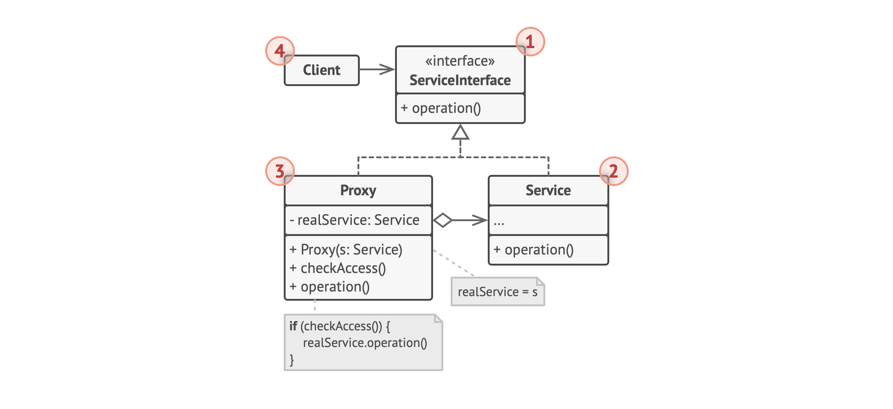

# Design Pattern 设计模式

### 设计模式总结

#### 创建型模式

- ****工厂方法模式（Factory Method）****:

工厂方法从顶层看是通过****特殊的工厂方法****创建对象来替代直接通过调用new运算符创建，底层实质还是通过new运算符创建，只是将这部分放在底层罢了。
这些工厂生产出来的产品必须***遵循共同的基类或者接口****。也即是说工厂方法并不是能够返回任意对象，而是一类具有同一特征的产品。


比如下面的例子直接使用new来创建，那么每个节点的实例是固定的，如果需要改变节点返回的对象必须修改全部节点，这样对于上层应用来说需要改动的点就比较多。


使用工厂模式后大体的结构如下所示，这个和上面的区别是每Transport结点不再是单一的运输工具，而是可以随意更换的实体结点。如果需要更换节点不需要改变顶层代码只需要改变Transport结点内部生产传输工具的规则即可，这样上层很容易做到对这些结点的更换。


****总结****：

工厂方法将创建产品的代码与实际使用产品的代码分离， 从而能在不影响其他代码的情况下扩展产品创建部分代码。

- 结构图：


在使用工厂方法进行重构的时候，首先需要将各个节点对象特征进行抽象，将其抽象成一个约束接口。这个接口作为工厂生产方法的返回出口。

- ****抽象工厂模式（Abstract Factory）****:

抽象工厂其实从名字上并不能传达出它的实际功能，光看名字很难了解它的实际用途，确实它是一个工厂，但是这个工厂的作用是用于生产一套套方案的，而不是一个个物品。这种问题一般是一个二维的矩阵，一个是物体，一个是特性。见下面例子：

```
1. 一个萝卜一个坑，大萝卜大坑，小萝卜小坑。那么萝卜和坑是物体，大和小是特性。

2. Window系统下的UI控件，和Linux系统下的UI控件. 这里各个控件是物体，Window风格和Linux风格是特性。

3. 现代Modern风格的家具，维多利亚Victorian风格的家具，装饰风艺术Art­Deco风格的家具，这里家具是物体，风格是特征。

```


在抽象工厂中，每个抽象工厂生产的是物体，而不同抽象工厂生产的是不同特征的物体。


- ****创建者模式（Builder）:****

创建者模式主要用在两种场景：

1. 通过将整体构建过程和具体部件的构建过程分离，达到使用同一个构建过程创建出不同表示的目的。
2. 创建目标对象步骤十分灵活繁琐，并且有些情况需要设置某些参数，有些则不需要。


创建者模式的主要变化集中在Director中。而Builder只负责生成产品对象并按照Director的指导构建产品，最后通过Builder执行交付产品工作。Director负责根据不同的类型调用Builder执行不同的产品构建过程。

也就是说应用层只负责将建造者交给指导者，指导者知道怎么创建一个产品，但是具体的产品生产过程是通过建造者来完成的。创建步骤在Director中，但是每个环节怎么实现是放在Builder中。要创建不同的对象只需要，创建不同的Builder交给Director，由Director指导Builder一步一步完成产品生成任务，最后按照Builder -> Director -> 应用层 这样层次结构逐级交付。

- 原型模式（Prototype）:

原型模式一般用在需要快速创建大量相似的对象的情景下。它与用new 创建对象的区别在于：原型模式是一种内存二进制拷贝，所以比使用new产生对象的方式来得快速高效。所以在需要重复地创建相似对象时可以考虑使用原型模式。比如需要在一个循环内创建对象，并且对象创建过程比较复杂或者循环次数很多的情况，使用原型模式不但可以简化创建过程，而且可以使系统的整体性能提高很多。

原型模式的另一个优点在于它可以将组成当前对象的内部依赖以及内部私有成员的都封装起来。原型模式将克隆过程委派给被克隆的实际对象。 模式为所有支持克隆的对象声明了一个通用接口， 该接口让你能够克隆对象， 同时又无需将代码和对象所属类耦合。 通常情况下，这样的接口中仅包含一个克隆方法。比如我们有一个数组，放的是各种形状，但是我们不用具体知道每个形状的类型，只知道它们都是形状，我们要复制出一批相同的数组，这时候只要在每个对象上调用copy方法，即可完成任务，具体不同形状复制的细节上层不用在意，上层也不用引入不同形状的依赖，这些都封装在各个形状的内部。通过这种方式我们在复制的过程不用在意具体的形状的区别，只有在使用的时候才需要关注它到底是哪个形状。


为了完善原型模式可以新建一个工厂类来实现注册表， 或者在原型基类中添加一个获取原型的静态方法。 该方法必须能够根据客户端代码设定的条件进行搜索。搜索条件可以是简单的字符串， 或者是一组复杂的搜索参数。 找到合适的原型后，注册表应对原型进行克隆，并将复制生成的对象返回给客户端。最后将对子类构造函数的直接调用替换为对原型注册表工厂方法的调用。


- ****单例模式（Singleton）:****

对于单例模式，下面图比较形象：


它的特点如下：

1. 全局只有一个实例

    如果创建某个对象将会耗费过多的资源，或者需要某个对象作为某种设备或者其他对象的管理者的时候，比如对项目配置文件或者数据库进行读写的情况。这种情况下单例模式比较适用。

2. 整个应用生命周期都存在

3. 提供一个全局共享访问节点
    在应用的不同位置都可以访问单例对象

创建单例一般有如下两个步骤：

* 将默认构造函数设为私有， 防止其他对象使用单例类的new运算符。
* 新建一个静态构建方法作为构造函数。该函数会 “偷偷” 调用私有构造函数来创建对象，并将其保存在一个静态成员变量中。此后所有对于该函数的调用都将返回这一缓存对象。


#### 结构型模式

- ****适配器模式（Adapter）: 使接口不兼容的对象能够相互合作 ****


适配器主要用于连接两个交互接口存在差异的情况，比如我们重构一个旧系统，旧的接口数据结构和新接口数据结构存在差异的时候可以使用适配器来兼容两个接口。比如我们在对接多个数据源到同一个数据分析系统，这个数据分析系统目前只接受json格式的数据形式，而不同的数据源格式各种各样，有XML,Probuf,纯文本，数据库...这种情况下可以在数据分析系统与各个数据源数据交互的部分使用一个适配器对数据进行转接。更有甚者可以使用双向适配器来兼容不同的接口。


适配器模式首先需要定义一个客户端需要的接口，一般成为target接口，适配器实现这个接口，然后通过任何方式，往Adapter中注入Adapee,这个就是需要改造的旧接口。在Adapter的target接口方法中使用Adapee来实现对应的目标接口功能。

- ****外观模式（Facade）:为程序库、 框架或其他复杂系统提供一个简单的外部接口****


外观类为包含许多活动部件的复杂子系统提供面向客户端的 ****简单****,****功能有限**** 的接口。也就是说外观类的重点在于以简单的方式提供用户关心的，而不是大而全的接口。

它的主要目的就是让外部减少与子系统内部多个模块的交互，从而让外部能够更简单得使用子系统，如果你的程序需要与包含几十种功能的复杂库整合， 但只需使用其中非常少的功能， 那么使用外观模式会非常方便。

****外观类负责把客户端的请求转发给子系统内部的各个模块进行处理****。在使用外观模式的时候建议所有客户端代码仅通过外观来与子系统进行交互。****外界不能直接调用子系统接口****。

Facade 的方法本身并****不进行功能的处理，只是实现一个功能的组合调用****。并且一般不会在外观类中定义一些子系统没有的功能，它主要负责组合已有功能来实现客户端的需求，而不是添加新的功能实现。

一般系统只需要一个外观类，所以可以使用单例或者私有化构造方法，并将其他方法声明为静态方法。

外观模式的好处有如下几点：

1. 由于Facade类封装了各个模块交互的过程，如果今后内部模块调用关系发生了变化，只需要修改Facade实现就可以了。
2. 如果没有外观类，客户端需要和子系统内部多个模块交互，客户端和这些模块之间都有依赖关系，任何一个模块的变动都可能会引起客户端的变动。使用外观类之后客户端就不需要去关心系统内部模块的变动情况了，客户端只需要和这个外部类有依赖关系，这样当系统内部多个模块发生变化的时候，这个变化可以被这个外观类吸收和消化，并不影响到客户端。

- ****代理模式（Proxy）: 代理控制着对于原对象的访问， 并允许在将请求提交给对象前后进行一些处理****

代理模式通过创建一个代理对象来代替真实的对象，在客户端看来代理对象和真实对象并没有两样。实际的工作还是通过代理对象传到真实对象中。代理模式通过新建一个与原服务对象接口相同的代理类， 然后更新应用以将代理对象传递给所有原始对象客户端。 代理类接收到客户端请求后会创建实际的服务对象， 并将所有工作委派给它。

如果需要在类的主要业务逻辑前后执行一些工作(比如鉴权，添加Log)，我们无需修改类的实现就能完成这项工作



1. ****服务接口（Service Interface）**** 声明了服务接口。 代理必须遵循该接口才能伪装成服务对象。
2. ****服务（Service）**** 类提供了一些实用的业务逻辑。
3. ****代理（Proxy）**** 类包含一个指向服务对象的引用成员变量。 代理完成其任务 （例如延迟初始化、 记录日志、 访问控制和缓存等） 后会将请求传递给服务对象。 通常情况下， 代理会对其服务对象的整个生命周期进行管理。
4. ****客户端 （Client）**** 能通过同一接口与服务或代理进行交互， 所以你可在一切需要服务对象的代码中使用代理。

注入服务可以通过初始化代理对象的构造函数中注入，也可以通过在调用某个方法的时候，将服务对象作为参数传入。如果我们需要对一个已有的系统进行重构，这时候往往没有现成的服务接口，这时候从服务类中抽取接口并不总是可行的，因为这样做的话，需要对服务的所有客户端进行修改， 让它们使用接口。这样往往改动很大，这时候可以将代理作为服务类的子类，从服务类中继承所有的接口。

总而言之代理和服务的结合可以通过构造函数注入，调用方法作为参数注入，让代理继承服务类这三种方案来实现。

可以考虑新建一个构建方法来判断客户端可获取的是代理还是实际服务。 也可以在代理类中创建一个简单的静态方法， 也可以创建一个完整的工厂方法。可以考虑为服务对象实现延迟初始化。

代理的作用场景：

1. ****延迟初始化（虚拟代理）****。 如果你有一个偶尔使用的重量级服务对象， 一直保持该对象运行会消耗系统资源时， 可使用代理模式。你无需在程序启动时就创建该对象， 可将对象的初始化延迟到真正有需要的时候。

2. ****访问控制 （保护代理）****。 如果你只希望特定客户端使用服务对象， 这里的对象可以是操作系统中非常重要的部分， 而客户端则是各种已启动的程序 （包括恶意程序）， 此时可使用代理模式。代理可仅在客户端凭据满足要求时将请求传递给服务对象。

3. ****记录日志请求 （日志记录代理）****。 适用于当你需要保存对于服务对象的请求历史记录时。 代理可以在向服务传递请求前进行记录。

4. ****缓存请求结果 （缓存代理）****。 适用于需要缓存客户请求结果并对缓存生命周期进行管理时， 特别是当返回结果的体积非常大时。代理可对重复请求所需的相同结果进行缓存， 还可使用请求参数作为索引缓存的键值。

5. ****本地执行远程服务 （远程代理）****。 适用于服务对象位于远程服务器上的情形。在这种情形中， 代理通过网络传递客户端请求， 负责处理所有与网络相关的复杂细节。

6. ****智能引用****。 可在没有客户端使用某个重量级对象时立即销毁该对象。代理会将所有获取了指向服务对象或其结果的客户端记录在案。 代理会时不时地遍历各个客户端， 检查它们是否仍在运行。 如果相应的客户端列表为空， 代理就会销毁该服务对象， 释放底层系统资源。

- ****装饰模式（Decorator）: 通过将对象放入包含行为的特殊封装对象中来为原对象动态绑定新的行为****

装饰器在行为上和代理模式有点类似，都是通过实现同一个接口，然后通过往外部包裹类中注入一个类用来承载实际的操作，在外部包裹类中可以针对需要做一些额外的处理。

装饰器模式通过一个对象包含指向另一个对象的引用，并将部分工作委派给引用对象,一个对象可以包含多个指向其他对象的引用，这些指向关系可以在运行时动态更改，而继承则是通过对象继承父类的行为， 它们自己能够完成这些工作，不需要引用对象。所以它是静态的。装饰器实现了与其被装饰对象相同的接口。因此从客户端的角度来看，这些对象是完全一样的。 装饰器中的引用成员变量可以是遵循相同接口的任意对象。 这使得我们可以将一个对象放入多个装饰器中，并在对象中添加所有这些装饰器的组合行为。


使用场景：

1. 希望在无需修改代码的情况下即可使用对象，且希望在运行时为对象新增额外的行为，可以使用装饰模式。
2. 如果用继承来扩展对象行为的方案难以实现或者根本不可行（被final最终关键字限制对某个类的进一步扩展），这种情况可以使用该模式。

- ****桥接模式（Bridge）: 桥接模式适合于存在两个维度变化的情形，它将两个维度的变化独立开来，通过组合的方式来解决这个问题****

桥接模式将两个维度变化的情形独立区分开来，在使用的时候通过组合的方式来实现各种情况。在桥接模式中称两个独立的部分为抽象部分和实现部分。客户端面向抽象部分，抽象部分持有实现部分的引用。

****两者职责的划分****:

* 抽象对象里面的方法，会使用抽象部分接口中的方法。也可能需要调用实现部分对象来完成。这个对象中的方法通常都是和具体的业务相关的方法。
* 实现部分的接口，提供基本实体操作，抽象部分定义的一般都是基于这些基本操作的业务方法。


可以通过上图来理解上面提到的概念，这里有两个纬度，一个是应用的版本，一个是应用的应用平台。版本可以有v1.0, v2.0, v3.0 ... 应用平台可以分成Windows,Linux,Mac OS,Android,iOS ... 我们可以通过一个v3.0的应用版本注入iOS 对应功能的API来发布一个在iOS系统上运行的v3.0应用版本。

****如何在抽象对象中注入实际对象****

1. 由客户端负责创建，并在创建抽象部分接口的时候作为参数设置到抽象部分的对象中去。
2. 可以在抽象部分对象构建的时候，由抽象部分的对象自己来创建对应的现实部分的对象。
3. 可以使用抽象工厂或者简单工厂来选择并创建具体的实现部分。
4. 可以在抽象部分选择并创建一个默认的实现部分，子类可以根据具体的需要改变这个实现。

****何时使用桥接模式****

不希望抽象和实现部分采用固定的绑定关系的时候，可以采用桥接模式把抽象和实现部分分开，然后在程序运行期间动态得设置抽象部分需要用到的具体实现，还可以动态地切换具体的实现。
如果希望实现部分的修改不会对客户端产生影响，可以采用桥接模式，由于客户是面向抽象的接口在运行，实现部分的修改可以独立于抽象部分，而不会对客户端产生影响。

简而言之：如果你想要拆分或重组一个具有多重功能的庞杂类，或者在几个独立维度上扩展一个类，或者在运行时切换不同实现方法的情况下都可以使用桥接模式。

如果把抽象部分称为业务抽象部分感觉会更好理解，抽象部分负责业务的抽象，具体某部分业务中的实现细节差异部分放在实现部分。


- ****组合模式（Composite）: 可以使用它将对象组合成树状结构，并且能像在顶层无差别地使用组合对象和叶子对象****

组合模式的最大作用在于组合对象和叶子对象都遵循同一个接口，所以客户端可以无差别对待组合对象和叶子对象，从而可以在顶层使用通用的处理方式来操作，如果顶层是组合对象会通过对应的途径交付给其叶子结点来计算。最终以和叶子对象相同的方式交付给顶层，所以顶层可以无差别地看待组合对象和叶子对象。


- ****享元模式（Flyweight）: 摒弃了在每个对象中保存所有数据的方式，而是通过共享多个对象所共有的相同状态，从而在有限的内存中载入更多对象****

正常情况下我们创建一个对象在内存中保留一个对象的数据，在对象占用内存很小，或者对象数量不是很多的情况下没什么问题，但是在每个对象都很庞大，并且数量很多的时候，我们就需要考虑是否可以通过享元模式来解决这个问题。享元模式的核心思想是从这些大量的数据中找出重复的，可复用的部分，通过共享来减少内存空间的使用。从而能在有限的内存容量中载入更多对象。

举个例子来说明下，比如我们需要开发一款游戏，我们每次都会随机出现恐龙，野人，怪兽这三类物体，然后我们点击屏幕都会射出子弹来射击这些目标，这种情况我们点击快的时候，或者出现大量恐龙，野人，怪兽的时候就会很卡。内存会严重飙升。这种情况怎么优化？如果用享元模式的化，可以考虑将能够抽取的公共数据给抽取出来一类物体共享。比如这些物体的坐标，速度，行走的方向这些是每个物体独有的，是不能共享的。在享元模式中称为外部状态，那些可以决定一类物体特性的数据，比如恐龙的特征模型，野人的特征模型，怪兽的特征模型，子弹的特征模型，这些数据在一个类的物体间可以共享。称为内部状态也叫享元。不论多少个怪物都只有一份数据。每个怪物都由内部状态和外部状态两部分组成，一个怪物特性数据，一个怪物独有数据。

为了能更方便地访问各种享元， 你可以创建一个工厂方法来管理已有享元对象的缓存池。 工厂方法从客户端处接收目标享元对象的内在状态作为参数， 如果它能在缓存池中找到所需享元， 则将其返回给客户端； 如果没有找到， 它就会新建一个享元， 并将其添加到缓存池中。


简单概括一下：享元模式适合于如下场景：

* 需要生成数量巨大的相似对象
* 对象中包含可抽取且能在多个对象间共享的重复状态。


- 使用享元模式核心在于找到内在状态和外在状态
1. 内在状态：包含不变的,可在许多对象中重复使用的数据的成员变量。
2. 外在状态：包含每个对象各自不同的情景数据的成员变量

- 保留类中表示内在状态的成员变量,并将其属性设置为不可修改.这些变量仅可在构造函数中获得初始数值。
- 找到所有使用外在状态成员变量的方法,为在方法中所用的每个成员变量新建一个参数,并使用该参数代替成员变量。
- 可以有选择地创建工厂类来管理享元缓存池,它负责在新建享元时检查已有的享元。如果选择使用工厂,客户端就只能通过工厂来请求享元,它们需要将享元的内在状态作为参数传递给工厂。
- 客户端必须存储和计算外在状态的数值， 因为只有这样才能调用享元对象的方法。为了使用方便，外在状态和引用享元的成员变量可以移动到单独的情景类中。

#### 行为型模式

- ****责任链模式（Chain of Responsibility）:****


责任链主要解决的问题是那些****处理环节经常变动****的情景，责任链将整个问题分成请求或者称为待处理问题和责任链或者称为处理环节这两大部分。请求无需关注责任链的细节，只要描述好待处理的问题即可，而责任链则主要关注为解决这个问题它要怎么去组织整个链的结点。

每次客户端发出一个请求，很多对象都有机会来处理这个请求，我们就可以将这些能够处理这个请求的对象组成一个责任链，客户发出的请求可以顺着这个责任链传递。

这个责任链是可以****动态变化的****，也就是客户端请求的处理流程是可以变化的。责任链中的各个处理请求的对象时可以替换的。

在标准的责任链模式中，只要有对象处理了请求，这个请求就不再被处理和传递了。但是也有种变体：每个责任链的对象都对这个请求进行一定功能处理，而不是被处理后就停止，这种变体一般称为功能链。

责任链的组织方式：

1. 在客户端组合责任链，这种称为外部链。
2. 在Handler类中实现链的组合，各个职责对象自己决定后续的处理对象，这种称为内部链。
   
每个对象都会按照条件来判断是否属于自己处理的范围，如果是就处理，如果不是就转发请求给下个对象，如果传到最后还是没有被处理就传给默认的处理对象对其进行处理。

在责任链模式中，请求者和接收者之间是一种****松散耦合的关系****。请求者并不知道接收者是谁，也不知道具体将会如何处理，请求者只是负责向责任链发出请求，而每个处理对象也不管请求者或者是其他的职责对象，只负责处理自己的部分，其他就交给其他的处理对象来处理。

- ****观察者模式（Observer）:****

观察者模式是一种一对多的关系，多个对象监听某个目标对象的事件，当目标对象的事件发生的时候，所有监听这个事件的对象都将得到通知，并执行对应的方法。这种模型会把目标对象自身通过方法传递给观察者，这样观察者就可以通过这个引用来获取了，还有一种并不会直接将整个对象传递过去而只是传递部分需要的数据过去。

在观察者模式中数据传递有两种方式：

1. 推模型：
目标对象主动向观察者推送目标的详细信息，不管观察者是否需要，推送的信息是对象的全部或者部分数据。
2. 拉模型：
目标对象在通知观察者的时候，只传少量信息，如果观察者需要具体的信息，由观察者主动到目标对象中获取，相当于是观察者从目标对象中拉数据。


- ****模板方法模式（Template Method）:****


模板方法是通过定义一个算法骨架模版，而将算法中的步骤延迟到子类，这样子类就可以覆写这些步骤的实现来实现算法之间的差异。也就是说模版方法中算法的步骤是固定的，但是算法的关键结点是可变的，子类通过覆写对应的步骤方法，即可重用算法的步骤。

从实现角度来看：模板方法主要通过制定模板，把算法步骤固定下来。至于谁来实现，模板可以自己提供，也可以子类去实现，还可以通过回调让其他类来实现。

在模板里面包含如下几类方法：
1. 模板方法：用于定义算法的框架。
2. 具体方法：在模板中直接实现某些步骤的方法，通常这些步骤的实现算法是固定的，而且是不怎么变化的，因此可以将其当做公共功能实现在模板中
3. 抽象方法，在模板中定义的抽象操作，通常是模板方法需要调用的操作，而且这些操作在父类中还没有办法确定下来。需要子类来实现真正的方法。
4. 回调方法：通过回调机制来调用其他类中的方法。
5. 工厂方法，在模板方法中如果需要得到某些对象的实例的话，可以考虑通过工厂方法来获取，把具体的创建对象延迟到子类中去。

- ****访问者模式（Visitor）:****

如果要给某个已有的对象在运行时时期添加某个方法可以借助访问者模式进行实现，将新行为放入一个名为访问者的独立类中， 而不是试图将其整合到已有类中。现在，需要执行操作的原始对象将作为参数被传递给访问者中的方法，让方法能访问对象所包含的一切必要数据。如果需要该操作能在不同类的对象上执行的话可以在访问者类定义一组访问方法。且每个方法可接收不同类型的参数。需要注意的是这里是在运行时动态添加的而不是像装饰器那样静态添加。访问者模式实现的时候需要记住一句话：“被访问者接受(accept)访问者(visitor)访问自己“ 由于访问者拿到了被访问者所以就可以在访问者内部调用被访问者方法的方法实现对应的访问方法。而访问者里面声明的是针对每个被访问者的一系列的访问方法。

最关键的是被访问者的accept方法，以及访问者的visit方法。


 
- ****状态模式（State）:****
- ****策略模式（Strategy）:****
- ****命令模式（Command）:****
- ****调停者模式（Mediator）:****
- ****备忘录模式（Memento）:****
- ****迭代器模式（Iterator）:****
- ****解释器模式（Interpreter）:****

#### 前端常见架构模式

### 以往的总结内容

- [Android进阶之设计模式](http://tbfungeek.github.io/tags/Android-%E8%AE%BE%E8%AE%A1%E6%A8%A1%E5%BC%8F/)
- [iOS-Design-Pattern](https://github.com/tbfungeek/iOS-Design-Pattern)
- [DesignPattern](https://github.com/tbfungeek/DesignPattern)

### 推荐书籍：
- [深入设计模式](https://refactoringguru.cn/design-patterns/book)
- [研磨设计模式](https://book.douban.com/subject/5343318/)
- [设计模式之禅](https://book.douban.com/subject/25843319/)
- [Head First 设计模式](https://book.douban.com/subject/2243615/)
- [设计模式-可复用面向对象软件的基础](https://book.douban.com/subject/1052241/)
- [大话设计模式](https://book.douban.com/subject/2334288/)
